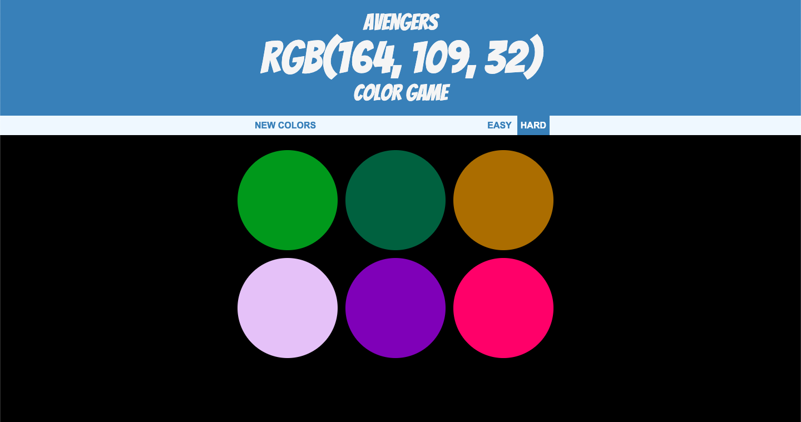
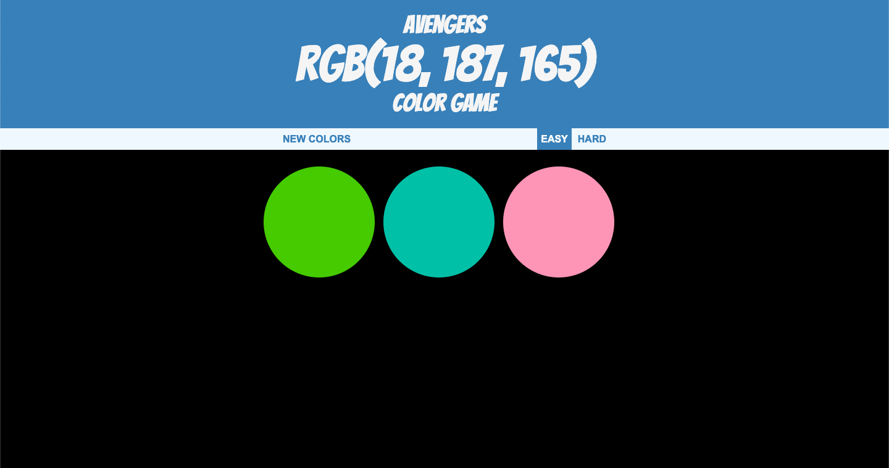

# Color Game
     
- A RGB color guessing game . 
- The user gets a random RGB color code every time and had to guess the correct color .
- The game has two difficulty level , ie, easy and hard.
- This game will help the user in learning more about RGB color system

## Hard Mode

## Easy Mode

